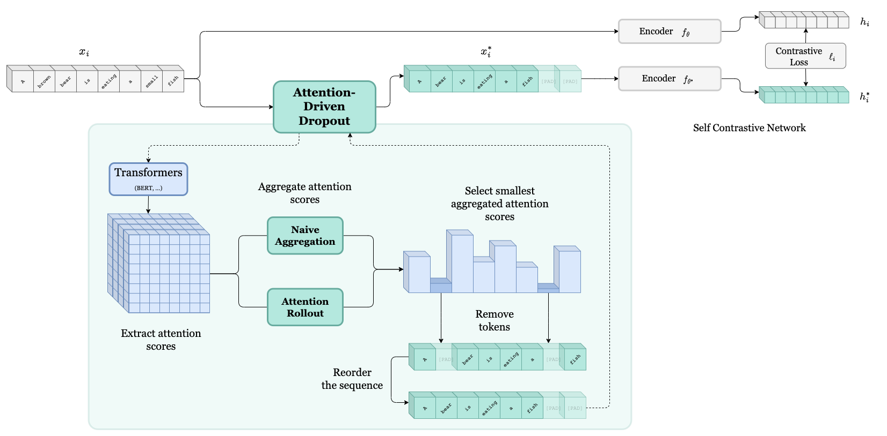

# Attention-Driven Dropout (ADD)

[](https://github.com/git/git-scm.com/blob/main/MIT-LICENSE.txt)
[](https://www.python.org/)
[](https://github.com/huggingface/transformers)
[](https://github.com/pytorch/pytorch)
[](https://github.com/princeton-nlp/SimCSE)



#

This repository contains code for the Attention-Driven Dropout paper. 

> [!NOTE]  
> This paper was accepted at the [ECML PKDD 2024](https://2024.ecmlpkdd.org/) conference.
> [**The paper can be found here**](https://link.springer.com/chapter/10.1007/978-3-031-70341-6_6).


> [!NOTE]  
> Since the **ADD** layer is used in combination with [SimCSE](https://github.com/princeton-nlp/SimCSE), we are using parts of the SimCSE codebase.
> Unique contributions are contained in [attention_driven_dropout.py](attention_driven_dropout.py), as well as [simcse/models.py](simcse/models.py) and [train.py](train.py) which are marked by 
> ```python
> # ====================================
> # ===== Attention-Driven Dropout =====
> # ====================================
> or 
> # ADD
> ``` 
> 
> We added the alignment and uniformity metric calculation in [SentEval/senteval/sts.py](SentEval/senteval/sts.py) as well as part of the evaluation.


## Table of contents

- [Attention-Driven Dropout (ADD)](#attention-driven-dropout-add)
- [](#)
  - [Table of contents](#table-of-contents)
  - [Installation](#installation)
  - [Usage/Examples](#usageexamples)
    - [Download datasets](#download-datasets)
    - [Training](#training)
    - [Evaluation](#evaluation)
    - [Examples](#examples)
  - [Experiment tracking](#experiment-tracking)
  - [Acknowledgements](#acknowledgements)


## Installation

Python version used: 3.8.15

Requirements with their pinned versions can be found in [requirements.txt](requirements.txt).

```bash
pip install -r requirements.txt
pip install -e ./SentEval
```

## Usage/Examples

### Download datasets

Training Dataset
```bash
cd data
sh download_wiki.sh
cd ..
```

Evaluation Datasets
```bash
cd SentEval/data/downstream/
sh download_dataset.sh
cd ../../../
```

### Training

Training our BERT model with settings from the paper

```bash
python train.py \
    --model_name_or_path bert-base-uncased \
    --train_file ./data/wiki1m_for_simcse.txt \
    --output_dir ./result/<your-model-name> \
    --overwrite_output_dir \
    --num_train_epochs 1 \
    --per_device_train_batch_size 32 \
    --learning_rate 1e-5 \
    --evaluation_strategy steps \
    --metric_for_best_model stsb_spearman \
    --load_best_model_at_end \
    --eval_steps 125 \
    --mlp_only_train \
    --do_train \
    --do_eval \
    --fp16 \
    --half_precision_backend cuda_amp \
    --use_attention_dropout \
    --n_dropout 1 \
    --min_tokens 10 \
    --dropout_rate static \
    --summation_method naive \
```

### Evaluation

Convert the SimCSE model to huggingface format
```bash
srun python simcse_to_huggingface.py --path ./result/<your-model-name>
```

Evaluation on STS-Tasks
```bash
python evaluation.py --pooler cls_before_pooler --task_set sts \
    --model_name_or_path ./result/<your-model-name>
```

or include the Transfer-Tasks as well
```bash
python evaluation.py --pooler cls_before_pooler --task_set full \
    --model_name_or_path ./result/<your-model-name>
```

### Examples

Example sentence augmentations can be found in [notebooks/examples.ipynb](notebooks/examples.ipynb).

Figures presented in the paper can be found in [notebooks/figures.ipynb](notebooks/figures.ipynb).


## Experiment tracking

We are using [Weights & Biases](https://www.wandb.com/) to track experiments.

You can customize your runs by passing these arguments to the train script

```bash
--wandb_run_name=<your-run-name> \
--wandb_project=<your-project-name> \
--wandb_tags="add,bert,<additional tags>" \
```

## Acknowledgements

We are using SimCSE's training procedure and codebase to conduct our experiments.

- [SimCSE](https://github.com/princeton-nlp/SimCSE)

We follow the steps in the following repository for calculating the Rollout Attentions from Samira Abnar and Willem Zuidemas paper [Quantifying Attention Flow in Transformers](https://arxiv.org/abs/2005.00928):

- [Rollout Attention](https://github.com/samiraabnar/attention_flow)
