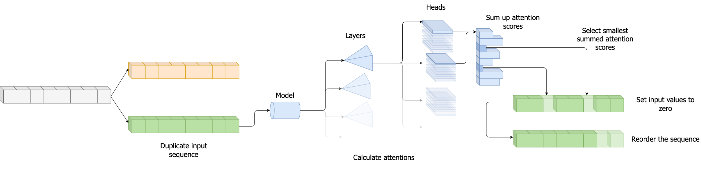

#

This repository contains code for the Attention-driven Dropout paper. It contains the example codes for different task descriptions.


## Table of contents
* [Badges](#general-information)
* [Installation](#Installation)
* [Usage/Examples](#Usage/Examples)
* [Results](#Results)
* [Experiment tracking](#Experiment-tracking)
* [Acknowledgements](#Acknowledgements)

## Badges

[](https://github.com/tterb/atomic-design-ui/blob/master/LICENSEs)
[](https://opensource.org/licenses/)
[](http://www.gnu.org/licenses/agpl-3.0)

### Dependency


## Installation

```bash
pip install -r requirements.txt
pip install -e ./SentEval
```
## Usage/Examples

### Download datasets

Training Dataset
```bash
cd data
sh download_wiki.sh
cd ..
```

Evaluation Datasets
```bash
cd SentEval/data/downstream/
sh download_dataset.sh
cd ../../../
```

### Training

Training our BERT model with settings from the paper

```bash
python train.py \
    --model_name_or_path bert-base-uncased \
    --train_file ./data/wiki1m_for_simcse.txt \
    --output_dir ./result/<your-model-name> \
    --overwrite_output_dir \
    --num_train_epochs 1 \
    --per_device_train_batch_size 32 \
    --learning_rate 1e-5 \
    --max_seq_length 32 \
    --evaluation_strategy steps \
    --metric_for_best_model stsb_spearman \
    --load_best_model_at_end \
    --eval_steps 125 \
    --pooler_type cls \
    --mlp_only_train \
    --temp 0.05 \
    --do_train \
    --do_eval \
    --fp16 \
    --half_precision_backend cuda_amp \
    --use_attention_dropout \
    --dynamic_dropout
```

### Evaluation

Convert the SimCSE model to huggingface format
```bash
srun python simcse_to_huggingface.py --path ./result/<your-model-name>
```

Evaluation on STS-Tasks
```bash
python evaluation.py --pooler cls_before_pooler --mode test --task_set sts \
    --model_name_or_path ./result/<your-model-name>
```

or include the Transfer-Tasks as well
```bash
python evaluation.py --pooler cls_before_pooler --mode test --task_set full \
    --model_name_or_path ./result/<your-model-name>
```

## Results

We used the following hyperparameters for training our models.

|                      | Unsup. BERT | Unsup. RoBERTa |
| :------------------- | :---------: | :------------: |
| Batch size           |     32      |      128       |
| Learning rate (base) |    1e-05    |     7e-06      |


### STS-Tasks

|                                   |   STS12   | STS13 | STS14 |   STS15   |   STS16   |   STS-B   | SICK-R |   Avg.    |
| :-------------------------------- | :-------: | :---: | :---: | :-------: | :-------: | :-------: | :----: | :-------: |
| Dynamic Attention Dropout BERT    | **71.04** | 82.29 | 74.37 | **82.65** | **78.86** | **78.20** | 69.61  | **76.72** |
| Dynamic Attention Dropout RoBERTa |   65.20   | 80.30 | 71.73 |   81.35   |   80.40   |   79.46   | 67.56  |   75.14   |

### Transfer-Tasks
|                                   |  MR   |  CR   | SUBJ  | MPQA  | SST2  | TREC  | MRPC  | Avg.  |
| :-------------------------------- | :---: | :---: | :---: | :---: | :---: | :---: | :---: | :---: |
| Dynamic Attention Dropout BERT    | 80.62 | 85.96 | 94.56 | 88.95 | 84.95 | 88.00 | 74.14 | 85.31 |
| - w/ MLM                          | 81.95 | 87.53 | 95.77 | 88.21 | 86.66 | 92.20 | 74.32 | 86.66 |
| Dynamic Attention Dropout RoBERTa | 81.94 | 86.91 | 93.10 | 85.82 | 87.04 | 83.40 | 74.90 | 84.73 |
| - w/ MLM                          | 83.99 | 88.56 | 94.68 | 87.35 | 89.79 | 88.00 | 77.10 | 87.07 |


### Alignment and Uniformity

Alignment and Uniformity are measured for the STS-Benchmark task on the whole dataset.

|                                   | Alignment | Uniformity |
| --------------------------------- | --------- | ---------- |
| Dynamic Attention Dropout BERT    | 0.1790    | -2.3710    |
| Dynamic Attention Dropout RoBERTa | 0.1978    | -2.4385    |


## Experiment tracking

We are using [Weights & Biases](https://www.wandb.com/) to track experiments.

You can customize your runs by passing these arguments to the train script

```bash
--wandb_run_name=<your-run-name> \
--wandb_project=<your-project-name> \
--wandb_tags="ado,bert,<additional tags>" \
```

## Acknowledgements

We use Simcse code for...:

- [Simcse](https://github.com/princeton-nlp/SimCSE)

We follow steps in following repository for rollout-attention:

- [Roll-out attention](https://github.com/samiraabnar/attention_flow)
